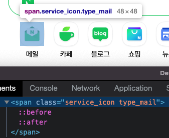

# naver-clone

### 네이버 클론코딩하며 배운 부분 정리 및 순서

- [`::before` & `::after`](#before--after)
- [`:nth-of-type`](#nth-of-type)
- `:focus-within`(예정)
- 속성 선택자 종류(예정)
- flex-direction과 flex-flow (예정)
- grid와 flex(예정)
- vertical-align(예정)

# `::before` & `::after`

## 정의

`::before` & `::after`는 CSS에서 사용할 수 있는 가상 앨리먼트(pseudo-element)이다. 

우선 MDN에는 이렇게 나와있다.
> In CSS, `::before`/`::after` creates a **pseudo-element** that is the first/last child of the selected element. It is often used to add cosmetic content to an element with the content property. It is inline by default. *- MDN*

직역하면,

`::before`/`::after`는 선택한 앨리먼트의 첫 번째/마지막 자식인 가짜 앨리먼트를 생성한다. 앨리먼트에 꾸미는(겉모양만 그럴듯한, 가상의) 컨텐츠를 추가하는데 `content` 프로퍼티와 함께 사용한다. 기본적으로 `inline`이다.

쉽게 말하자면 선택된 각 앨리먼트 내용 앞, 혹은 뒤에 무언가를 삽입한다. 마치 직계 자식 혹은 새로은 앨리먼트를 추가한다고 생각해도 된다.(추가한 듯이 보인다.) 그러나 `` 태그 같은 CSS의 형식 모델을 벗어난 [대체 앨리먼트](https://developer.mozilla.org/en-US/docs/Web/CSS/Replaced_element)에는 적용할 수 없다.

### pseudo-element란?

> A CSS pseudo-element is a keyword added to a selector that lets you style a specific part of the selected element(s). *- MDN*

CSS의 가상 앨리먼트는 선택자에 추가되는 키워드로, 선택한 앨리먼트의 특정 부분에 스타일을 지정할 수 있다.

가상 앨리먼트는 이중 콜론(`::`)이 사용되며 단일 콜론(`:`)은 가상 선택자(pseudo-class)를 사용한다.

선택자에는 하나의 가상 앨리먼트만 사용할 수 있다. 또한 가상 앨리먼트는 다른 모든 복합 선택자의 뒤에 넣어야 한다. 이를 이해하기 위해서 복합 선택자가 무엇인지 알아야 한다.

### 복합 선택자(complex & compound selector)란?

복합 선택자(complex & compound selector)란 [**CSS 선택자 구조**]("https://developer.mozilla.org/en-US/docs/Web/CSS/CSS_selectors/Selector_structure") 중 하나로 보통 CSS를 처음 배운 사람에게는 단순 선택자(simple selector)가 익숙할 것이다.

- 단순 선택자(simple selector)

  단순 선택자란 태그, class 혹은 id 값으로 지정하는 기본 선택자(basic selectors)와 속성 선택자(attribute selectors), 가상 클래스/앨리먼트 선택자(pseudo-class/element)이 있다. 주어진 앨리먼트를 가리키는 단순 선택자가 정확하게 그 앨리먼트를 가리킬 때 단순 선택자라고 한다.

  ```css
  /* 기본 선택자(basic selector) */

  * {
    box-sizing: border-box;
  }

  a {
    color: #000;
    text-decoration: none;
  }

  #wrap {
    text-align: center;
  }

  .blind {
    overflow: hidden;
  }

  /* 속성 선택자(attribute selector) */

  aside[id$=ad] { /* id의 값 끝에 ad라고 붙는 aside 태그 */
    border: 1px solid #008f76;
  }

  section[id^=main] { /* id 값이 main으로 시작하는 section 태그 */
    box-shadow: 0 0 0 1px #e3e5e8, 0 1px 2px 0 rgba(0, 0, 0, .04);
  }

  /* 가상 클래스/앨리먼트 선택자(pseudo-class/element) */

  a:hover {
    text-decoration: underline;
  }
  ```

복합 선택자에는 Compound selector, Complex selector가 있다. *(둘 다 뜻이 복합적이라는 뜻이어서 영어로 구분했다.)*

- Compound selector

  Compound selector는 단순 선택자의 연속이다. Compound selector는 하나의 앨리먼트의 동시 조건들의 집합이다. 공백은 후손 결합자를 나타내므로 허용되지 않는다.

  ```css
  #search-input:focus::placeholder {
    color: #e4e4e4;
  }
  ```

- Complex selector

  Complex selector는 하나 혹은 그 이상의 단순, Compound 선택자들의 연속이다. 또한 공백을 이용한 후손 결합자도 포함된다. Complex selector는 여러 앨리먼트들의 동시 조건들의 집합이다.

  ```css
  #header-notice > div {
    position: relative;
  }
  ```

이제 위에서 언급한 *가상 앨리먼트는 다른 모든 복합(complex, compound) 선택자의 뒤에 넣어야 한다.* 의 말 뜻을 이해할 수 있다. 

```css
#search > form:focus-within > #search-svg::after {
  content: '';
}
```

## 사용법/예시

`::before`과 `::after` 가상 앨리먼트에는 `content` 프로퍼티가 반드시 있어야 한다. 왜냐하면 가상의 자식에 담기는 내용이 `content` 프로퍼티에 담기기 때문이다.

```css
.class {
  ...
}

.class::before {
  content: '적고자 하는 텍스트';
  ...
  /* content 프로퍼티를 스타일링 할 CSS */
}

```

네이버에서도 `::before`과 `::after` 가상 앨리먼트를 발견할 수 있었는데, 네이버에서는 대게 아이콘에 가상 앨리먼트 적용을 했다. 미리 영역을 잡아둔 앨리먼트에 가상 앨리먼트를 추가해 가상 앨리먼트에 아이콘을 추가했다. `::before` 가상 앨리먼트에는 `border` 프로퍼티로 보이는 배경 테두리 아이콘을 넣었고, `::after` 가상 앨리먼트에는 내용을 상징하는 아이콘을 넣었다.



아이콘을 넣었기 때문에 content 프로퍼티에는 ''인 공백을 담았는데 이 프로퍼티에 특정 텍스트를 추가하면 다음과 같이 선택한 앨리먼트의 앞에 적은 텍스트가 표시된다.


또한 뉴스스텐드 쪽에 선택 옵션을 분리하는 아이콘에도 적용했다.


해당되는 CSS는 다음과 같이 폭이 4px인 원으로 스타일링 했다.

```css
.class::before {
  content: "";
  display: inline-block;
  width: 4px;
  height: 4px;
  background-color: var(--color_dot_divider);
  border-radius: 50%;
}
```

## 결론

네이버를 클론코딩하며 보았을 때, 아이콘 같은 상징적인 이미지이지만 대체되는 텍스트 등이 있을 때 배경 img 태그와 아이콘을 넣을 img 태그를 생성하여 여러 태그를 만드는 것 보다 가상 앨리먼트인 `::before`과 `::after`를 사용하여 넣는 것도 좋은 방법이 될 수 있을 것 같다. 또한 의미 없이 구분하기 위한 앨리먼트들에도 이 가상 선택자들을 사용하면 의미 없는 태그의 남용 없이 사용할 수 있을 것 같다.


# `:nth-of-type`

## 정의

`:nth-of-type`은 CSS 가상 클래스(pseudo-class)로 형제 앨리먼트 중에서 같은 타입(태그 이름)으로 순서를 매기는 것이다.

### `:nth-child`란?

`:nth-of-type`과 비슷하게 형제 엘리먼트 간에 순서를 매기는 다른 방법이 있다. 

`:nth-child`라고 이 또한 CSS 가상 클래스(pseudo-class)로 `:nth-of-type`와 다른 점은 `:nth-child`는 같은 타입(태그 이름)을 체크하지 않고 순서를 매긴다는 것이다.

즉, 형제 앨리먼트들의 태그가 `div`, `p`, `span`, `li`, ...로 섞여 있을 때 `li:nth-child(n)`을 했다면 태그 종류의 상관없이 태그가 삽입되어있는 순서대로 형제 앨리먼트 모두가 순서가 매겨지고 지정한 n의 조건대로 스타일 적용이 된다.

반면, 같은 조건에서 `li:nth-of-type(n)`으로 했다면 `li` 태그만 첫째, 둘째, 셋째, ... 로 순서가 매겨진다.

## 사용법/예시

### `:nth-of-type`

html과 css 구조는 다음과 같다.

`li` 태그인 경우는 `list-style-type` 프로퍼티를 이용해 숫자로 리스트를 매기도록 했고, 전체 형제 앨리먼트의 순서를 알기 위해 각 태그의 내용을 1부터 10까지 지정했다. 짝수에는 오렌지 테두리를, 홀수에는 초록색 테두리를 지정했다.

```html
<ul>
  <div>one</div>
  <li>two</li>
  <li>three</li>
  <li>four</li>
  <div>five</div>
  <li>six</li>
  <div>seven</div>
  <li>eight</li>
  <li>nine</li>
  <li>ten</li>
</ul>
```

```css
li {
  list-style-type: numeric;
}

li:nth-of-type(1) {
  font-weight: bold
}

li:nth-of-type(even) {  /* 2n */
  border: 2px solid orange;
}

li:nth-of-type(odd) {  /* 2n + 1 */
  border: 2px solid green;
}
```


결과는 리스트 태그만 순서를 매긴 것을 알 수 있다. 5번째 형제의 div 태그는 홀수이지만 순서에서 아예 배제되어있음을 알 수 있다.

### `:nth-child`

html은 위와 동일하고 css만 다음과 같이 변경한다. (첫 번째 자식의 font-weight 속성은 삭제했다.)

```css
li:nth-child(even) {
  border: 2px solid orange;
}

li:nth-child(odd) {
  border: 2px solid green;
}
```


`:nth-of-type`과 다르게 우선 전체 형제 앨리먼트의 순서를 매긴 것을 알 수 있다. 5, 7번째 형제의 div 태그는 홀수이지만 리스트 태그가 아니기 때문에 초록 테두리가 적용되지 않았다.

따라서 전체 태그의 순서나 규칙성에 스타일을 부여해야 한다면 `nth-child`를, 특정 태그 형제들끼리만이라면 `nth-of-type`를 사용하면 될 것 같다.


# `:focus-within`

## 정의

### CSS pseudo-classes 종류

## 사용법/예시
placeholder에서 작업

## 결론


# 속성 선택자 종류

## 정의

## 사용법/예시

aside[id$=ad], section[id^=main]

## 결론


# flex-direction과 flex-flow 차이


# grid와 flex

## flex

## grid, grid-row


# vertical-align
